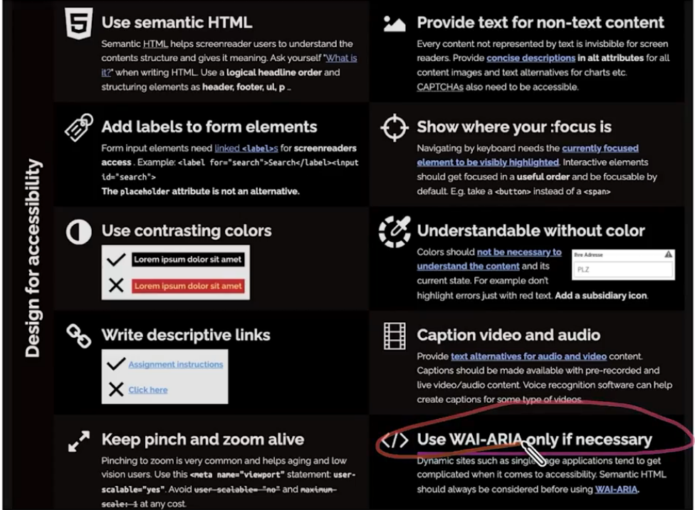
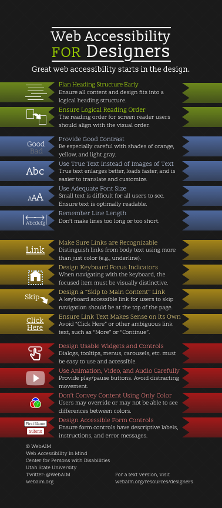

# Accessibility Tools

## Accessibility Testing Tools

- automated and manual tools that can help make things more accessible:

1. Automation
   - AXE (windows)
   - Espresso (android)
   - eslint-plugin-jsx-a11y (linter)
   - accessibility-checker (linter)
2. Manual
   - Lighthouse (chrome)
   - WAVE (chrome)
   - Element Inspector (chrome)
   - axe DevTools (chrome extension)
3. Out of the box
   - Material
   - Fluent UI

## Techniques for Accessibility Testing

- use semantic HTML
- add labels to form elements
- use color contrast
- write descriptive link text
- keep pinch and zoom enabled
- provide text for non-text content
- show where :focus is
- understandable without color
- caption videos and audio
- use WAI-ARIA only when necessary

