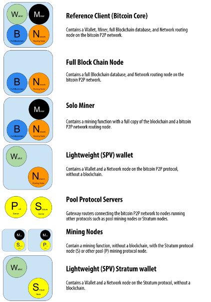
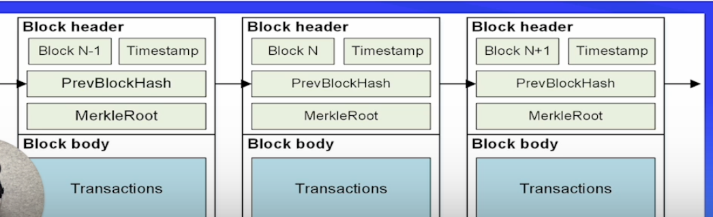
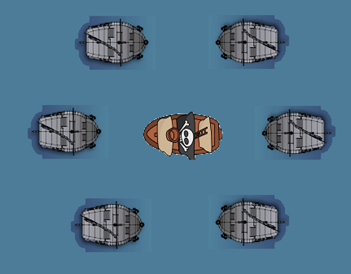

## Mining ⛏

- Mining is the process of creating a block of transactions to be added to the Ethereum blockchain
- Peers in the mining process are called “miners”
  - To network
  - Miners provide processing power to network in exchange for chance to get rewarded
- Mining is just an automated software that people run
  - There is no human element to mining except setup + maintenance

### Mining has TWO main functions:

1. Enforcement of consensus rules (very important!)
   - No double-spending, block size, check all txs
2. Currency issuance (not that important!)
   - Incentive to those who contribute security to the system

### Mining Algorithm

Q: When a miner “mines” a block, what does the miner actually do?
A: Mining software continuously hashes a block (containing txs) until a hash is found that meets a target difficulty

- Take current block’s block header
- Append a nonce, starting at nonce = 0
- Hash data from #1 and #2
- Check hash versus target (provided by protocol)
- If hash < target, puzzle is solved! Get rewarded.
- Else, restart process from step #2, but increment nonce

## Proof of Work

- A consensus mechanism is how decentralized networks like Bitcoin and Ethereum decide what blocks/txs are considered “valid” and who gets to add new blocks to the chain
- Proof-of-work and proof-of-stake are two different types of consensus mechanisms
- Bitcoin uses proof-of-work consensus while Ethereum will transition from PoW to PoS consensus
- In PoW, in order to add a block and receive a reward, a miner must present some type of proof that they spent significant resources securing the network
- The proof of work is the solution to the mining process
- Repeatedly hashing until we find a hash lower than the target difficulty
- Miners compete to find a valid proof of work every 10 minutes
- ⚔️ Solves the Byzantine Generals' Problem
- What chain is the “main chain”?

### The Byzantine Generals’ Problem

- Problem?
  - Coordination in a decentralized environment
- Solution?
  - Proof of Work Consensus
- Game Theory
  - Losing Strategy = Traitor Wins
  - Winning Strategy = Consensus

[📖 See Satoshi’s write-up on BGP](https://www.mail-archive.com/cryptography@metzdowd.com/msg09997.html)

