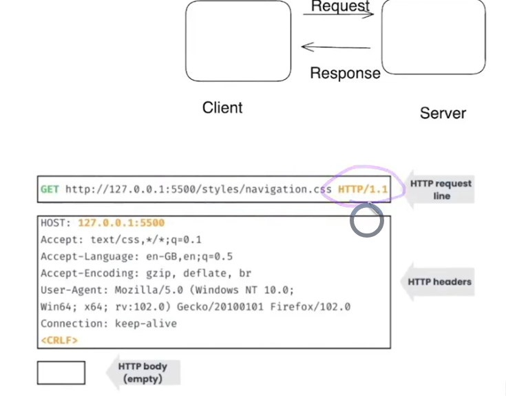
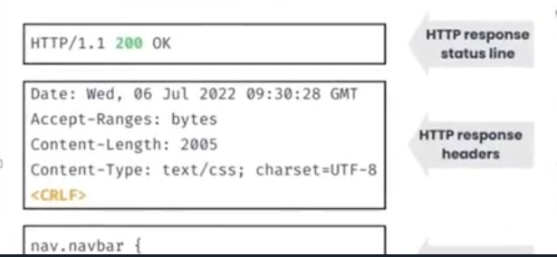

## sending or posting data using rest.http

- need to send data as object as json file
- need to specify what type of data are we sending by sending HEADER - `Content-Type: application/json`

## HTTP (HyperText Transfer Protocol)

HTTP is a protocol for fetching resources such as HTML documents. It is the foundation of any data exchange on the Web and it is a client-server protocol.

- client sends request to the server and waits for the response from it.
  The request contains information about the method used, the URL of the resource, and the version of HTTP being used. The server responds with the status of the request and the requested resource.
- Request Methods : GET, POST, PUT, DELETE, PATCH, OPTIONS, HEAD

## What is REST API?

REST stands for Representational State Transfer. It is an architectural style for designing networked applications. REST is a lightweight alternative to mechanisms like RPC (Remote Procedure Calls) and Web Services (SOAP, WSDL, etc).

### Architectural Constraints

User ---- UI/Frontend ---- Server

1. 1-tier architecture (Monolithic)

User ----- [UI/Frontend + Server]

2. 2-tier architecture (Client-Server)

User ----- [UI/Frontend] <--- (REST API) ---> [Server/backend]

3. 3-tier architecture

User ----- [UI/Frontend] <--- (REST API) ---> [Server/backend] <--- (REST API) ---> [Database]

### REST API

REST API is a set of rules that developers follow when they create their API. One of the rules states that you should be able to get a piece of data (called a resource) when you link to a specific URL.

- A style of building web applications and APIs that focuses on interactivity and simplicity.
- REST APIs are stateless, meaning that calls can be made independently of one another, and each call contains all of the data needed to complete itself successfully.
- REST APIs are designed around resources, which are any kind of object, data, or service that can be accessed by the client.
- REST APIs use a uniform interface, which helps to decouple the client and the server.
- REST APIs are driven by hypermedia links that are contained in the representation. This means that the client interacts with the server by exchanging representations of resources.
- The main constraints for designing RESTful systems
  - Client-Server
  - Stateless
  - Cacheable
  - Layered System
  - Uniform Interface
  - Code on Demand (optional)

#### HTTP (Hypertext Transfer Protocol)

- REST APIs use HTTP methods to perform different operations. The most common operations are GET, POST, PUT, PATCH, and DELETE.

## Why REST API?

- easy to build and understand.
- REST API is stateless, meaning that calls can be made independently of one another, and each call contains all of the data needed to complete itself successfully.
- flexible: can be used with any programming language.
- Scalable: can be used with any type of application.
- flexibility with data: can be used with any type of data (json, xml, etc).
- Uniform interface: REST APIs use a uniform interface, which helps to decouple the client and the server. This means that clients don't need to know anything about the server, and servers don't need to know anything about the client.
- statelessness: each request from client to server must contain all of the information necessary to understand the request, and cannot take advantage of any stored context on the server. Session state is therefore kept entirely on the client.
- caching: responses must define themselves as cacheable or not to prevent clients from reusing stale or inappropriate data in response to further requests.
- separation of concerns: client and server are independent of each other, and can evolve separately without any dependency on each other.
- interoperability (language agnostic):
- security: REST APIs can be secured using HTTPS, which encrypts the data being sent between the client and the server.

## Building blocks of REST API

1. Request

2. Response

### URL (Uniform Resource Locator) parts

`https://www.example.com/forum/questions?tag=networking&order=newest#top`

- `https` - protocol, scheme
- `www.example.com` - domain name, hostname
  - `www` - subdomain
  - `example` - second-level domain
  - `com` - top-level domain (TLD)
- `/forum/questions` - path
  - `/forum` - directory
  - `/questions` - file
- `?tag=networking&order=newest` - query string
  - `tag=networking` - key-value pair (parameter)
  - `order=newest` - key-value pair (parameter)
- `#top` - fragment identifier

### HTTP Methods

### CRUD Operations

| Operation | Description                 | HTTP Method |
| --------- | --------------------------- | ----------- |
| Create    | Create a new resource       | POST        |
| Read      | Read a resource             | GET         |
| Update    | Update an existing resource | PUT/PATCH   |
| Delete    | Delete a resource           | DELETE      |
| HEAD      | Get metadata of a resource  | HEAD        |
| OPTIONS   | Get allowed methods         | OPTIONS     |
| CONNECT   | Connect to a server         | CONNECT     |
| TRACE     | Trace a request             | TRACE       |

**PUT/PATCH** - PUT is used to update the entire resource, while PATCH is used to update part of the resource.

### Headers

- Headers are key-value pairs that provide additional information about the request or response.

1. Request headers

| header            | description                                                                                     | Use Case          | example                                                                                                                        |
| ----------------- | ----------------------------------------------------------------------------------------------- | ----------------- | ------------------------------------------------------------------------------------------------------------------------------ |
| Host              | The domain name of the server                                                                   | Origin host       | Host: www.example.com                                                                                                          |
| Origin            | The origin of the request                                                                       | CORS              | Origin: example.com                                                                                                            |
| Referrer          | The URL of the previous web page from which a link to the currently requested page was followed | Security          | Referrer: https://www.example.com/page1                                                                                        |
| User-Agent        | The user agent string of the client (identify the client: User agent string - OS, Browser)      | Browser detection | User-Agent: Mozilla/5.0 (Windows NT 10.0; Win64; x64) AppleWebKit/537.36 (KHTML, like Gecko) Chrome/58.0.3029.110 Safari/537.3 |
| Accept            | The media types that the client can understand (Response content type)                          | Content type      | Accept: application/json                                                                                                       |
| Accept-Language   | The language that the client can understand (preferred Response language)                       | Content language  | Accept-Language: en-US                                                                                                         |
| Accept-Encoding   | The encoding that the client can understand (preferred Response encoding)                       | Content encoding  | Accept-Encoding: gzip, deflate                                                                                                 |
| Connection        | The connection type (keep tcp connection alive)                                                 | Connection type   | Connection: keep-alive                                                                                                         |
| Authorization     | The credentials for authenticating the client with the server                                   | Authentication    | Authorization: Basic or Bearer -                                                                                               |
| Cookie            | The cookies that the client has sent to the server (previous server token)                      | Session           | Cookie: name=value; name2=value2                                                                                               |
| If-Modified-Since | The date and time that the client last modified the resource                                    | Caching           | If-Modified-Since: Tue, 15 Nov 1994 12:45:26 GMT                                                                               |
| If-None-Match     | The entity tag of the resource that the client has previously received                          | Caching           | If-None-Match: "etag"                                                                                                          |
| Cache-Control     | The caching directives that the client can understand                                           | Caching           | Cache-Control: no-cache                                                                                                        |

2. Response headers

| header           | description                                           | Use Case         | example                                      |
| ---------------- | ----------------------------------------------------- | ---------------- | -------------------------------------------- |
| Date             | The date and time that the response was sent          | Time             | Date: Tue, 15 Nov 1994 12:45:26 GMT          |
| Server           | The server software that generated the response       | Server           | Server: Apache/2.4.7 (Ubuntu)                |
| Content-Type     | The media type of the response body                   | Content type     | Content-Type: application/json               |
| Content-Length   | The length of the response body                       | Content length   | Content-Length: 348                          |
| Set-Cookie       | The cookies that the server has sent to the client    | Session          | Set-Cookie: name=value; name2=value2         |
| Content-Encoding | The encoding of the response body                     | Content encoding | Content-Encoding: gzip                       |
| Cache-Control    | The caching directives that the client can follow     | Caching          | Cache-Control: no-cache                      |
| Last-Modified    | The date and time that the resource was last modified | Caching          | Last-Modified: Tue, 15 Nov 1994 12:45:26 GMT |
| ETag             | The entity tag of the resource                        | Caching          | ETag: "etag"                                 |
| Expires          | The date and time that the response expires           | Caching          | Expires: Tue, 15 Nov 1994 12:45:26 GMT       |

### Request

### Response

### Status Codes

- Status codes are three-digit numbers that indicate the status of the HTTP response.

- Why Status code is important?
  - Status codes provide information about the status of the request.
  - Status codes help to debug issues with the request.
  - Status codes help to understand the response from the server.
  - Status codes help to handle errors and exceptions.

| Status Range | Use Case      | Status codes | Description                                                  |
| ------------ | ------------- | ------------ | ------------------------------------------------------------ |
| 1xx          | Informational | 100-199      | The request has been received and the process is continuing. |
| 1xx          | Informational | 100          | Continue                                                     |
| 1xx          | Informational | 101          | Switching Protocols                                          |
| 1xx          | Informational | 102          | Processing                                                   |
| 2xx          | Success       | 200-299      | The request was successful.                                  |
| 2xx          | Success       | 200          | OK                                                           |
| 2xx          | Success       | 201          | Created                                                      |
| 2xx          | Success       | 202          | Accepted                                                     |
| 2xx          | Success       | 204          | No Content                                                   |
| 2xx          | Success       | 206          | Partial Content                                              |
| 3xx          | Redirection   | 300-399      | - The request has more than one possible response.           |
| 3xx          | Redirection   | 301          | Moved Permanently                                            |
| 3xx          | Redirection   | 302          | Found                                                        |
| 3xx          | Redirection   | 303          | See Other                                                    |
| 3xx          | Redirection   | 304          | Not Modified                                                 |
| 3xx          | Redirection   | 307          | Temporary Redirect                                           |
| 3xx          | Redirection   | 308          | Permanent Redirect                                           |
| 4xx          | Client Error  | 400-499      | The request contains bad syntax or cannot be fulfilled.      |
| 4xx          | Client Error  | 400          | Bad Request                                                  |
| 4xx          | Client Error  | 401          | Unauthorized                                                 |
| 4xx          | Client Error  | 403          | Forbidden                                                    |
| 4xx          | Client Error  | 404          | Not Found                                                    |
| 4xx          | Client Error  | 405          | Method Not Allowed                                           |
| 4xx          | Client Error  | 408          | Request Timeout                                              |
| 4xx          | Client Error  | 429          | Too Many Requests                                            |
| 5xx          | Server Error  | 500-599      | The server failed to fulfill an apparently valid request.    |
| 5xx          | Server Error  | 500          | Internal Server Error                                        |
| 5xx          | Server Error  | 501          | Not Implemented                                              |
| 5xx          | Server Error  | 502          | Bad Gateway                                                  |
| 5xx          | Server Error  | 503          | Service Unavailable                                          |
| 5xx          | Server Error  | 504          | Gateway Timeout                                              |
| 5xx          | Server Error  | 505          | HTTP Version Not Supported                                   |
| 5xx          | Server Error  | 507          | Insufficient Storage                                         |
| 5xx          | Server Error  | 511          | Network Authentication Required                              |

## Postman

## HTTP 1/2/3

## Best Practices

## Advance Concepts
